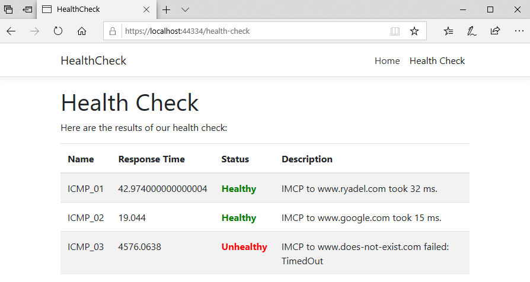

# HealthCheck

## SPA Com Angular e .Net Core (seguindo o livro: Valerio De Sanctis - ASP.NET Core 3 and Angular 9).

Este projeto é um SPA com Angular 9 e .net core 3 feito como parte do meu aprendizado de Angula/dotnet core.
O aplicativo da web irá atuar como um serviço de monitoramento e relatório que irá verificar o status de saúde de um servidor de destino - e / ou sua infraestrutura - e mostrá-lo na tela em tempo real.
Para fazer isso, vamos fazer bom uso do pacote Microsoft.AspNetCore.Diagnostics.HealthChecks, um pacote integrado ao recurso do .NET Core framework. Este pacote deve ser usado para permitir um serviço de monitoramentos para verificar o status de outro serviço em execução.

Para obter informações adicionais sobre as verificações de integridade do .NET Core,ver documentação oficial da MS em
https://docs.microsoft.com/en-us/aspnet/core/host-and-deploy/health-checks?view=aspnetcore-3.0

Possíveis resultados

- Healthy (Saudável): Podemos considerar o hospedeiro Saudável sempre que o PING tiver êxito sem erros e tempos limite.
- Degraded (Degradado): Podemos considerar o hospedeiro Degradado sempre que o PING conseguiu, mas a viagem de ida e volta é muito longa.
- Unhealthy (Insalubre): Podemos considerar o host insalubre sempre que o PING falhar, ou seja, o tempo de verificação expira antes de qualquer resposta.

